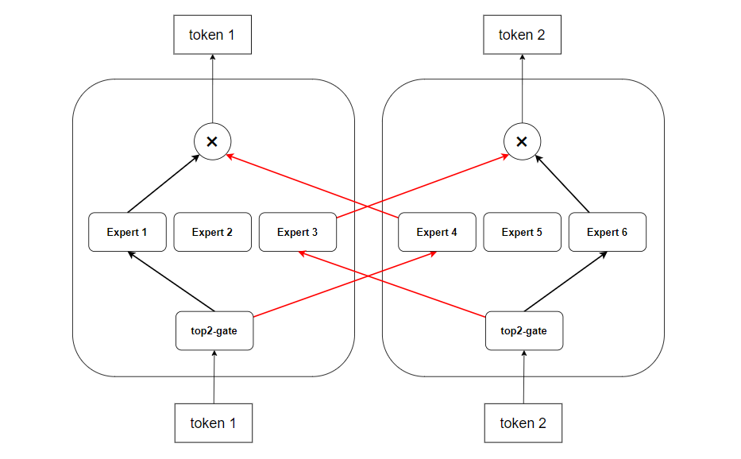

# Ascend Moe 相关特性

## 整体方案：

Mixture of Expert（MoE）是指混合专家模型功能。在大模型训练中使用该功能可以将常规的稠密大模型变成稀疏的MoE大模型，在计算量不显著增加的情况下大幅提升模型的参数量。

通过使用专家并行（Expert Parallelism，EP），把专家分配到多个NPU上，减轻单个NPU的显存压力，也就是说专家并行（Expert Parallelism，EP），对全量专家进行分组。
如图所示，一个包含6个专家的MoE模型在EP=2时的专家分布情况。可以把专家并行理解成模型并行的一种形态（模型被切分成多份），但是输入的数据又是不同的（DP），因此token在经过Router之后，可能会选中别的卡上的专家，此时就需要将这些token发送过去，即EP进程组内需要通过All2All通信交换token。值得注意的是，该MoE模型在token选择专家时，如果超过容量会drop掉token。

## 特性背景：

支持moe模型及相关特性的兼容和适配，包含MoE基础模型、MoE适配序列并行（SP）、MoE适配长序列（CP）、MoE token重排性能优化。

1.Mindspeed新增MoE混合专家模型（Mixtral 8*7B），支持使用MoE模型进行训练。

2.MoE支持序列并行(sequence parallel)，支持MoE与序列并行同时开启，减少MoE模块计算，提升MoE模块的训练性能。

3.MoE适配长序列(context parallel)特性，支持MoE和CP特性同时开启。

4.MoE适配分布式优化器特性，支持MoE和分布式优化器同时开启，降低内存，减少OOM风险。

5.MoE token重排性能优化，减少token选择专家的gate计算量，提升训练性能。

## 使用场景

在需要处理大规模数据集和复杂任务的情况下，使用基于 moe 结构的大模型，以及其他SP、CP等特性。

### 使用建议：

MoE+SP 建议默认开启。开启SP需要同时开启TP。

MoE+cp 建议处理长序列时开启。

MoE+分布式优化器 建议默认开启。

Token重排优化 建议默认开启。

## 使用方法

MoE特性基础功能:
| 重要参数| 参数说明  |
|  ----  | ----  |
|--moe-model-type deepspeed_moe |使用mixtral模型 |
|--num_experts  [int]             |专家数          |
|--expert_model_parallel_size [int]  |专家并行     |

MoE支持序列并行:
|重要参数| 参数说明  |
|  ----  | ----  |
|--sequence-parallel            |开启SP          |

MoE适配长序列:
| 重要参数| 参数说明  |
|  ----  | ----  |
|--context-parallel-algo megatron_cp_algo |配置CP算法|

MoE适配分布式优化器:
|重要参数| 参数说明  |
|  ----  | ----  |
|--use-distributed-optimizer |开启分布式优化器特性|

MoE特性token重排优化:
|重要参数| 参数说明  |
|  ----  | ----  |
|--enable-token-rearrange-opt |开启token重排|
