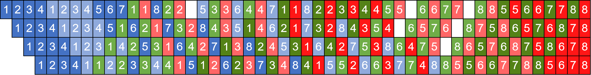
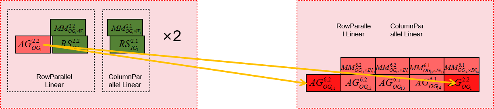
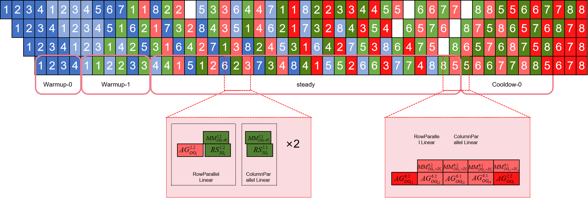

# nanopipe流水线并行

## 问题分析

流水线并行是AI大模型大规模分布式训练的关键组成部分之一，但其效率收到流水线中bubble的影响，为了提高吞吐量，需要降低其bubble比例。

## 解决方案

在大模型流水线调度中，反向的input梯度和weight梯度通常是一起调度计算的，然而，通过分析他们计算的依赖关系，可以发现其实只有input梯度的计算存在相互层间的依赖关系。因此，通过独立调度反向的input梯度和weight梯度的计算，我们可以减少流水线调度的bubble。

反向Input梯度和Weight一起调度的Interleaved 1F1B

独立调度imput梯度和weight梯度的nano-pipe

独立调度weight计算展示图

### 解决思路:

* 分离weight梯度计算流程，通过修改RowParallelLinear和ColumnParallelLinear的backward实现，将对weight的梯度计算进行剥离，先存储在调度器的dw计算队列中。
* 在需要对dw计算时，从调度器的dw计算队列中pop出一个计算，然后计算对应的梯度。

### 内存优化及通信隐藏：

相比[Zero Bubble Pipeline Parallelism](https://arxiv.org/abs/2401.10241),在做dw计算时matmul要用的张量存在内存中没有释放，导致动态内存占用过大, nanopipe仅保留部分必要的激活值，节省大量内存，但是增多了通信。再采用并行matmul和all-gather以达到通信隐藏的目的。

其中，将input梯度计算的列切割中的all-gather通信转移到行切割的前方并进行通信隐藏，节省了一个all-gather的通信量。

## 完整的nanopipe

## 使用场景

在训练模型时，降低bubble的比例，从而提升计算效率，达到更好的流水线并行。

## 使用方法

设置`--use-nanopipe`，默认为False，根据用户需求配置。

## 使用效果

提升计算效率，减少bubble占比。

场景1：单机, TP=1, 关SP, PP=4, SEQ=4096, hidden-size=4096
| device | TP | SP | PP | SEQ | hidden-size | Nano vs vpp收益 |
| :-----: | :----: | :----: | :-----:| :----: | :----: | :-----: |
| 单机 | 1 | 关 | 4 | 4096 | 4096 | 3.66% |

场景2：双机, TP=4, PP=4, SEQ=8192, hidden-size=12288
| device | TP | SP | PP | SEQ | hidden size | Nano vs vpp收益 | Nano_mc2 vs vpp_mc2收益 |
| :-----: | :----: | :----: | :-----:| :----: | :----: | :-----: | :-----: |
| 双机 | 4 | 开 | 4 | 8192 | 12288 | 1.58% | 1.1% |
