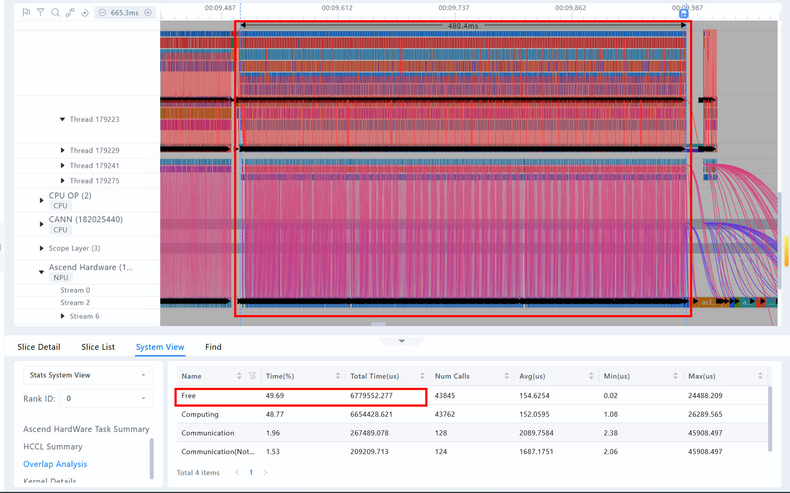
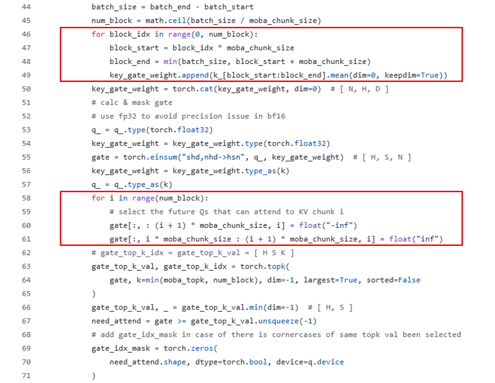
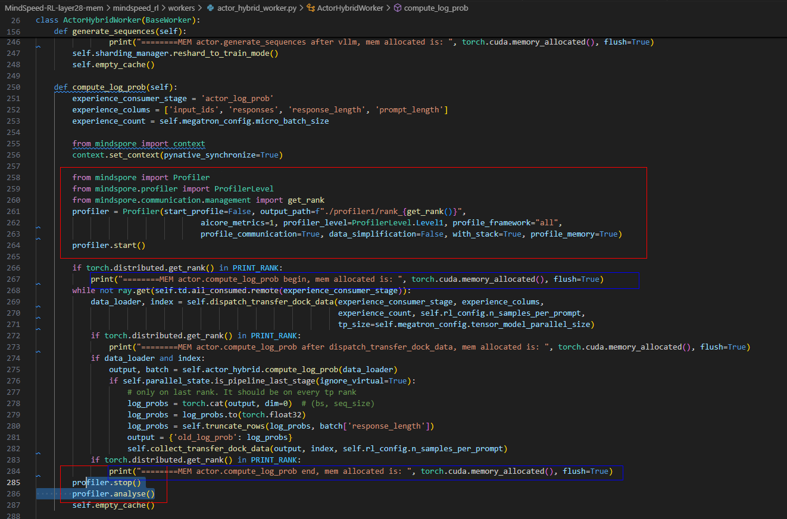
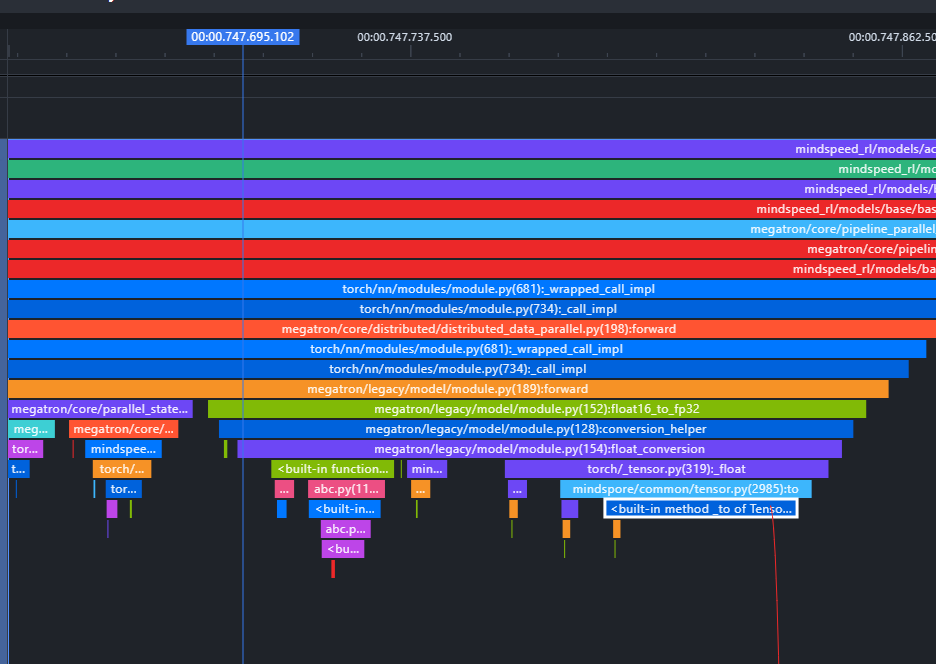
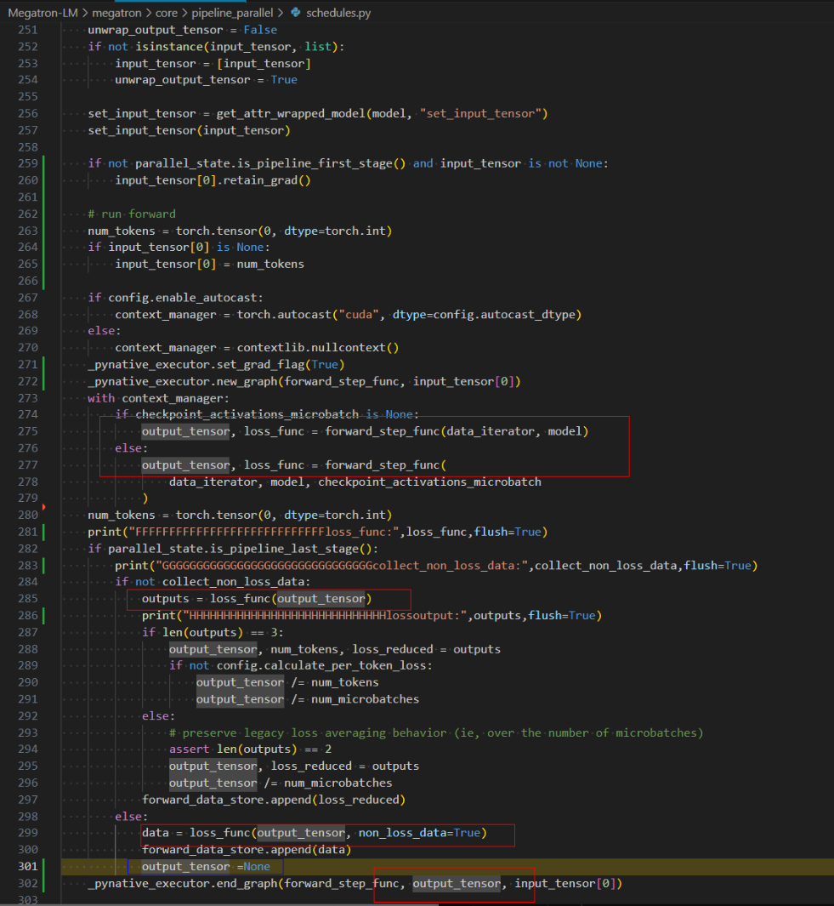

# MindSpeed MindSpore后端训练性能调优指南

## 0 前言

当前大模型相关业务发展迅速，华为昇腾提供了[昇腾MindSpeed + 昇腾NPU训练解决方案](https://www.hiascend.com/software/mindspeed)，以供昇腾硬件用户更便捷地在昇腾NPU上进行大模型训练。当前该套解决方案已支持用户使用PyTorch或者MindSpore框架作为后端。
大模型具有更多的参数量和更复杂的模型结构，在训练过程中需要耗费更多的计算资源和时间。尤其在AI框架动态图模式下易于开发调试带来了极大的灵活性，但也暴露了更多的性能及内存问题。昇腾社区提供了动态图模式的[通用性能调优思路](https://www.hiascend.com/document/detail/zh/Pytorch/700/ptmoddevg/trainingmigrguide/performance_tuning_0001.html)。本文将介绍MindSpeed+MindSpore AI框架+华为昇腾NPU场景（后文使用**MA**代替）下，大模型性能及内存的一些调优方法，以及如何使用工具快速分析并解决瓶颈，帮助大模型开发者们快速上手模型性能调优，提升训练效率，降低训练成本。

MindSpeed+PyTorch+Ascend NPU(PTA)场景后文使用**PTA**代替，以下不再单独声明；

## 1 性能优化

### 性能调优基本概念

#### 典型性能统计指标

- 单步时间(s)：执行完一个完整batch数据的时间。
- 吞吐(Samples/s)：网络模型在单位时间内可以处理的最大样本数。throughput=BS∗N/step_time。其中，BS为每个数据并行维度的batch size大小，N为集群中数据并行维度的大小，step_time为在分布式集群中，执行完一个完整BS的时间（单位为s）。
- MFU(%)：Model FLOPs Utilization，即模型算力利用率，是指模型一次前反向计算消耗的矩阵算力与机器算力的比值。它直接反映了模型在训练过程中对计算资源的有效利用程度。MFU的值受到多种因素的影响，包括但不限于：
    - 模型架构：不同架构的模型在分布式训练中的算力利用率可能存在显著差异。例如，Transformer架构的模型由于其并行性和矩阵运算密集的特点，通常能够在分布式训练中实现较高的MFU。
    - 分布式训练策略：包括数据并行、模型并行、流水线并行等不同的并行策略及这些策略的具体实现方式（如梯度累积、张量并行等），都会对MFU产生重要影响。
    - 硬件环境：显卡型号、数量、网络连接速度等硬件因素都会限制分布式训练的性能和算力利用率。
    - 软件优化：包括编译器优化、库函数优化、自动混合精度训练等软件层面的优化措施，也能在一定程度上提升MFU。
    - 数据集和批次大小：数据集的大小和复杂性，以及训练时使用的批次大小，也均会影响每次迭代中的计算量和算力利用率。
- 线性度：单卡训练扩展到多卡、多机多集群后的效率度量指标称为线性度，又名加速比，一般根据吞吐率计算得到。即集群线性度为多机总吞吐率/（单机吞吐率*集群卡数）。线性度的取值范围为0~1，数值越接近于1，其性能指标越好，一般大于0.8认为较优。

### 性能问题通用分析思路

为了优化前文介绍的性能度量指标，提升训练效率，一般从如下几个维度拆解优化。

- 数据处理耗时：指模型加载训练数据和权重的时间，包括将数据从硬件存储设备读取到CPU、在CPU中进行数据的预处理、以及CPU数据传输到NPU的过程。对于需要切分到若干张NPU上的模型，数据加载时间还包括从一张NPU广播到其他NPU上的时间。
- Host下发耗时：指Python侧脚本逻辑及api接口launch的时间，一般希望这部分耗时与Device执行流水起来，避免Device空闲。
- Device执行耗时：NPU侧执行各个算子计算逻辑的时间。
- 通信耗时：指在分布式训练中，设备之间进行通信传输的时间，可以通过优化网络拓扑、减少通信频率等方式来减少通信耗时。同时，通信和计算通常可以并行执行，并行库提供的并行技术会保证部分通信时间被掩盖。

### 用户编程checklist及配置建议

一些配置或者编程方式对性能有较大影响，我们建议用户在性能调优前根据以下checklist做一遍排查，确保观测到的性能数据是准确的：

- 关闭确定性计算
  去除启动命令中的 `--use-deter-comp`开关（模型启动脚本中默认不带该参数），去除环境变量 `HCCL_DETERMINISTIC`配置（默认关闭）

  ```shell
  export HCCL_DETERMINISTIC=False
  ```

- 关闭流同步：

  ```shell
  # 若未设置环境变量，则默认关闭
  export MS_DEV_HOST_BLOCKING_RUN=0
  export MS_DEV_LAUNCH_BLOCKING=0
  ```

- 使用高性能API，如融合算子RotaryPositionEmbedding、Swiglu等
- 避免冗余的数据拷贝
    - 尽量采用原地更新接口
    - 减少不必要的转连续操作：当前aclnn算子大多支持非连续输入，尽量减少在脚本中大量使用.contiguous()，或可以先is_contiguous()判断后再调用。
    - 避免频繁数据拷贝：需要数据拷贝时，尽量采用.from_numpy接口，当数据连续时，会通过免拷贝方式将Numpy数组转换为张量。
- 减少原生Python累加函数使用

### 性能数据采集及分析思路

MA环境的性能数据采集方式与PTA环境保持一致，用户可参考所使用的大模型套件（[MindSpeed-LLM](https://gitee.com/ascend/MindSpeed-LLM/blob/master/docs/pytorch/features/profiling.md)、[MindSpeed-MM](https://gitee.com/ascend/MindSpeed-MM/blob/master/mindspeed_mm/tools/README.md)）的Profiling数据采集说明。

Profiling如下有3种模式：

- 1. 仅采集device侧信息，不采集Python堆栈信息。该种方式对迭代性能影响小，可以分析device侧计算、通信算子执行耗时。以下是一个配置示例：

  ```shell
     PROFILE_ARGS="
         --profile \
         --profile-step-start 10 \
         --profile-step-end 14 \
         --profile-save-path ./profile \
         --profile-level level0 \
     "
  ```

- 2. 采集device侧和框架侧信息，不采集Python堆栈信息。该种方式对迭代性能影响小，可以额外分析算子下发耗时；

  ```shell
     PROFILE_ARGS="
         --profile \
         --profile-step-start 10 \
         --profile-step-end 14 \
         --profile-save-path ./profile \
         --profile-level level0 \
         --profile-with-cpu \
     "
  ```

- 3. 采集device侧、框架侧以及Python堆栈信息。该种方式对迭代性能影响大，主要用于在方式2基础上进行Python侧API定位；

  ```shell
     PROFILE_ARGS="
         --profile \
         --profile-step-start 10 \
         --profile-step-end 14 \
         --profile-save-path ./profile \
         --profile-level level0 \
         --profile-with-cpu \
         --profile-with-stack
     "
  ```

我们建议用户参照如下思路进行Profiling数据采集和分析：

- 1. 将Profiling迭代步设置为3步，分析最后一个迭代步的性能；
- 2. 设置 `global_batch_size=DP*PP*micro_batch_size*2`以减小数据采集量；
- 3. 先使用模式2进行MA的Profiling数据采集，对比分析算子下发和硬件层执行情况；
- 4. 再使用模式3进行MA的Profiling数据采集，结合步骤3分析的算子下发和硬件层执行情况，定位Python调用栈具体API问题。

另外，采集到的Profiling数据可结合可视化工具进行分析。

### 性能数据可视化

昇腾社区面向AI开发者提供了可视化调优工具 MindStudio，以帮助用户进行性能数据的可视化分析，该工具的使用参见[MindStudio用户指南](https://www.hiascend.com/document/detail/zh/mindstudio/80RC1/GUI_baseddevelopmenttool/msascendinsightug/Insight_userguide_0002.html))。

### 性能分析典型案例

#### MoBA Attention性能异常

##### 问题现象

原生MoBA Attention从PyTorch GPU迁移到MindSpore NPU时，性能大幅劣化。

##### 分析定位

按照上述性能数据采集分析思路，分析性能数据后发现，Host侧算子下发耗时长导致Device空闲较多。



通过调用栈定位到性能瓶颈在两处for循环中：



##### 优化方案

两处For循环均可采用矩阵运算方式进行优化，减少循环导致的频繁算子下发。
第一处优化如下：

```python
if batch_size % moba_chunk_size == 0:
    key_gate_weight = k_.reshape((num_block, moba_chunk_size,) + k_.shape[1:]).mean(dim=1, keepdim=False)
else:
    key_gate_weight_pre = k_[:(num_block - 1) * moba_chunk_size].reshape((num_block-1, moba_chunk_size,) + k_.shape[1:]).mean(dim=1, keepdim=False)
    key_gate_weight_last = k_[(num_block - 1) * moba_chunk_size:batch_size].mean(dim=0, keepdim=True)
    key_gate_weight = torch.cat([key_gate_weight_pre, key_gate_weight_last], dim=0)
```

第二处优化如下：

```python
# select the future Qs that can attend to KV chunk i
row_block = torch.arange(gate.shape[1], device=gate.device) // moba_chunk_size
block_idx = torch.arange(moba_chunk_size, device=gate.device)
eq_mask = row_block.unsqueeze(1) == block_idx.unsqueeze(0)  # (seq_length, num_block)
lt_mask = row_block.unsqueeze(1) < block_idx.unsqueeze(0)  # (seq_length, num_block)
inf_mask = torch.where(eq_mask, float("inf"), gate)
inf_mask = torch.where(lt_mask, float("-inf"), inf_mask)
gate.add_(inf_mask)
```

## 2 显存优化

模型运行过程中的显存占用主要由已申请显存和显存碎片组成，其中已申请显存又分为静态显存（权重、梯度），动态显存（激活）和工作区显存（临时的计算等）。在显存优化过程中应重点关注动态显存。

### 用户编程checklist及配置建议

- 打开虚拟内存：建议打开虚拟内存，减少大块Block的申请导致的显存峰值过高，开启方式如下。值得注意的是，MS_ALLOC_CONF为kv格式，多个配置项需要一次性设置，以逗号分隔，避免多次设置被刷新。

  ```shell
  export MS_ALLOC_CONF="enable_vmm:True"
  ```

- 手动开启GC：建议在每隔几百个step时，手动开启垃圾回收机制，它会检测不再使用的对象，并释放它们所占用的内存空间，如下所示：

  ```python
  import gc
  gc.collect()
  ```

### 显存数据采集及通用分析思路

如上述checklist排查和显存配置优化均完成后仍有显存不足的风险，则可根据下列流程分析具体细节。

1. 根据模型计算理论显存值，可参考[论文](https://arxiv.org/pdf/2205.05198)。
2. 减小 `global_batch_size`并等比例缩小模型规模（训练场景减小迭代步数，建议2~3步迭代），进行显存数据采集。当前MindSpeed MindSpore后端无法像PTA一样在`PROFILE_ARGS`中加入`--profile-with-memory`即可采集显存数据，而需要打开流同步以及显存抓取配置后，执行启动脚本进行显存数据采集：

   ```shell
      # 打开流同步及显存抓取配置
      export MS_DEV_HOST_BLOCKING_RUN=1
      export MS_DEV_LAUNCH_BLOCKING=1
      export MS_ALLOC_CONF="memory_tracker:True"
   ```

3. 可使用[runtime内存分析工具](https://gitee.com/reku1997/ms_runtime_memory_tool)（非官方）或者[MindInsight工具](https://www.hiascend.com/document/detail/zh/mindstudio/70RC2/msinsightug/msascendinsightug/AscendInsight_0008.html)进行显存数据解析，重点分析被异常持有的显存。

### 显存优化典型案例

#### GRPO Qwen内存泄漏

#### 问题现象

在Qwen GRPO训练中，发现每迭代一次，内存会上涨几百M，当迭代到一定次数之后会导致OOM

#### 问题定位

1. 通过加打印初步定位是actor和reference两个模型的compute_log_prob存在的内存泄漏。

```python
print("========MEM actor.compute_log_prob after dispatch_transfer_dock_data, mem allocated is: ", torch.cuda.memory_allocated(), flush=True)
```



2. 内存数据获取

由于grpo训练是在ray框架下进行的，无法使用mindspore自带的memory tracker采集内存数据。
使用profiling获取模型的内存数据，需要将采集profiling中的profile_memory=True，这里采集actor下compute_log_prob下的内存数据，具体如下：

```python
from mindspore import Profiler
from mindspore.profiler import ProfilerLevel
from mindspore.communication.management import get_rank
profiler = Profiler(start_profile=False, output_path=f"./profiler1/rank_{get_rank()}",
                            aicore_metrics=1, profiler_level=ProfilerLevel.Level1, profile_framework="all",
                            profile_communication=True, data_simplification=False, with_stack=True, profile_memory=True)
profiler.start()

'''
forward code
'''

profiler.stop()
profiler.analyse()

```

3. 查找调用栈

得到profile数据后，发现每28个FlashAttentionScore算子后面有一个Cast算子未释放。通过mindinsignt查找调用栈，根据其在第28个flashattention之后，其前面为matmul算子后面为add算子，找到Cast算子。发现该算子发生在`val = val.float()`代码行，考虑到`.float()`算子出现问题的概率较小，因此该问题大概率是被其他地方使用了而未释放。



4. 查看被使用情况

经过定位，该output输出在两个地方被使用。最终定位是该输出是在_pynative_executor.end_graph(forward_step_func, output_tensor, input_tensor[0])被持有了。由于grpo中只计算前向，反向计算不在该处，output_tensor不应该入图，入图一直持有。



#### 解决方案

如上图蓝色框所示，将output_tensor=None