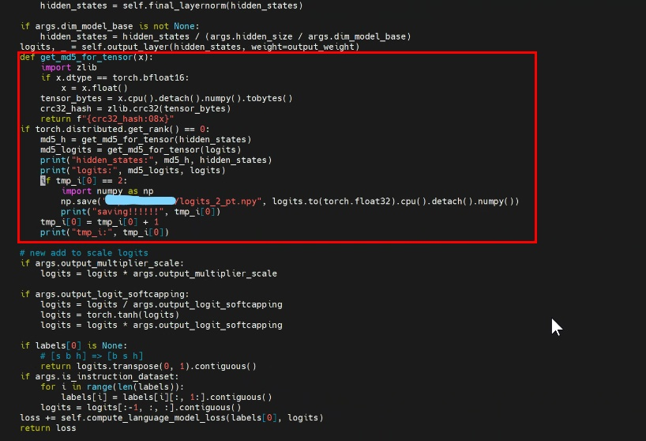
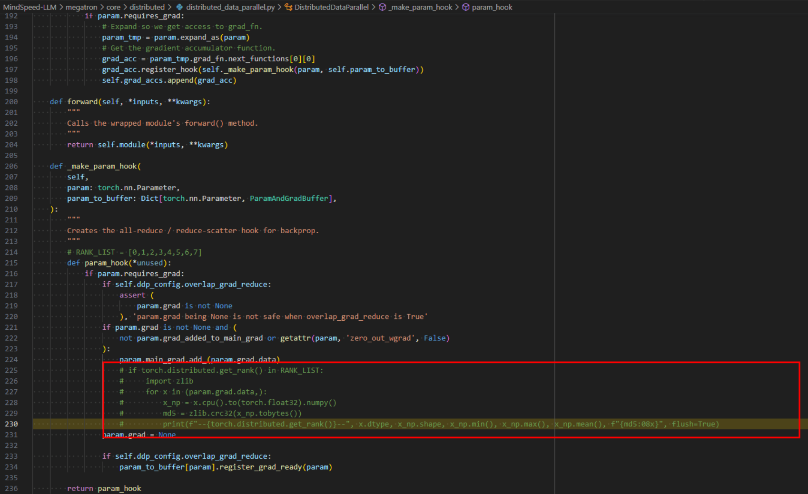
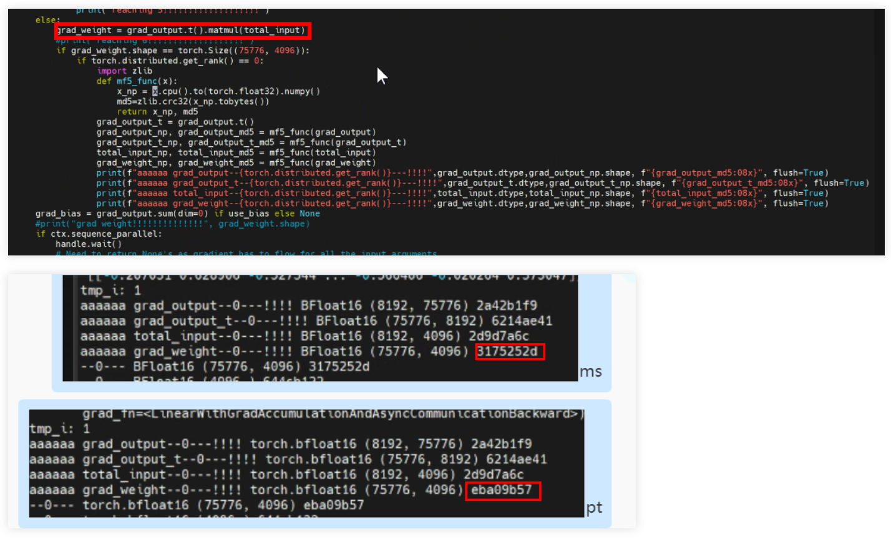

# MindSpeed MindSpore后端精度调优指南

## 0 前言

用户在将模型迁移到MindSpeed + MindSpore后端（后文用**MA**代替）后，需要进行精度调试。昇腾官网[PyTorch训练模型迁移精度调试](https://www.hiascend.com/document/detail/zh/Pytorch/700/ptmoddevg/trainingmigrguide/LMaccuracy_0002.html)指南提供的精度调试通用思路同样适用于MindSpore框架。本指南重点阐述在MindSpeed + MindSpore后端上进行精度调试调优的一些具体操作和案例，旨在帮助用户快速上手进行精度调试。

## 1 精度调优

### 用户编程checklist及配置建议

- 建议使用`conda`环境，相关软件版本满足匹配关系。
- 开启确定性计算，并使用相同的随机种子。

  以下是在主程序脚本中加入相关设置的样例，供参考：

  ```python
  def seed_all(seed=42):
      import os
      import random
      import numpy as np
      random.seed(seed)
      os.environ['PYTHONHASHSEED'] = str(seed)
      np.random.seed(seed)
      torch.manual_seed(seed)
      torch.use_deterministic_algorithms(True)
      torch_npu.npu.manual_seed_all(seed)  # NPU环境中使用
      torch_npu.npu.manual_seed(seed)  # NPU环境中使用

  if __name__ == "__main__":
      seed_all()
      pretrain(...)
  ```

  以及NPU环境中打开通信算子确定性

  ```shell
  export HCCL_DETERMINISTIC=True
  ```

- GPU和NPU上模型启动脚本参数保持一致，且模型初始化状态保持一致（例如加载相同的模型ckpt）。重点校验以下超参：
    - 学习率：基础学习率值、学习率衰减策略等
    - batchsize&step：包括micro_batch_size和global_batch_size，训练的总step数
    - 优化器参数：
        - 基本参数：包括优化器类型、学习率、weight_decay、momemtum等优化器参数
        - 参数分组策略：对于有优化器参数分组的情况，检查每个分组的参数是否一致
        - 训练参数个数：对于有参数冻结的场景，检查传入优化器的参数是否一致
- 对比规模较大的模型，优先等比例缩减模型规模，使用单机进行精度对比，其次再等比例扩展模型规模，使用多机进行精度对比

用户按照上述建议，若发现MindSpeed MindSpore后端训练的loss/gradnorm与GPU差异过大，则可参考下述精度问题分析思路进行分析。

### 精度问题通用分析思路

用户在使用MindSpeed MindSpore后端进行模型训练时，可能遇到如下常见的精度问题现象

| 常见现象 |
|  ----   |
| loss跑飞，出现Nan，Inf，极大值|
| 各个Step的Loss一致，不变化 |
| loss不收敛，来回震荡 |
| loss收敛慢 |
| 梯度溢出 |
| loss正常收敛，但是评估指标很低 |

以上现象都可能导致评估指标不符合预期。如果出现以上现象，可参考以下几点进行精度调试。

- 数据集对比
    - 数据对比checklit

    | 数据集对比项  | 详细说明 |
    | ---- | ---- |
    | 使用的数据集是否和对标网络一致 | |
    | 数据归一化或标准化参数是否对齐 | 归一化或标准化常见的操作方法包括Resize、Rescale、Normalize等 |
    | 数据集混洗开启逻辑是否对齐 | shuffle操作可以打乱数据顺序，有助于避免过拟合。 |
    | 数据集增强方式是否对齐对标；数据集增强方式的参数值是否和对标网络一致 | 增强方式一般有RandomCrop，RandomHorizontalFlip(注：推理数据集一般不需要随机操作) |
  - 数据集处理结果可视化。一般情况下，原始数据集会经过一系列数据增强操作，最终转换为网络的输入。如果数据增强操作有问题，可能会导致与标杆误差过大。此时，我们可以将经过数据增强后的数据转换为可视化的数据，比如cv网络，可以转换成图片，并将label标记在图片上，观察增强后的数据是否合理，大致判断数据处理过程是否存在问题。
  - 数据集处理结果精细对比。可以使用[TroubleShooter](https://gitee.com/mindspore/toolkits/tree/46df29e618fbfa06dbd7ae8d3be44998332331a4/troubleshooter)工具将数据处理结果保存为npy文件进行精细对比。

- 网络算法对比
  计算图结构是模型计算的载体。计算图结构与标杆网络不一致，一般是实现算法代码时写错，可从以下几个方面进行网络算法对比。主要逻辑是：控制相同网络权重和输入，对比网络输出是否存在差异，如果存在差异，按照从大到小的范围，排查出造成差异的算子或操作，进行修改。
    - 网络权重对比
    网络权重是基础，如果权重和标杆网络不一致，后续的对比调试将没有意义。可按照以下思路进行对比：
        - 排查参数个数是否一致；
        - 排查参数shape是否一致；
        - 排查参数是否有冻结；
    - 网络输出对比
    控制相同的网络权重和输入，对比网络的输出结果（包括正向网络输出和loss）是否在误差范围内。如果是，说明网络基本没有问题，可以优先进行其它对比。否则可以逐层对比找出差异产生的具体位置。
    - 逐层对比
    在动态图模式下，可以使用Debug工具或者troubleshooter、msprobe工具进行对比。
        - Debug工具对比：使用pycharm、vscode等工具的Debug功能，在指定位置设置断点查看算子的输入输出。
        - troubleshooter工具：与数据集处理结果对比类似的，可将网络中API的输入输出保存为npy文件进行精细对比。
        - msprobe工具：msprobe工具提供整网的API输入输出数据dump功能，可直接进行数据对比。

- 评估算法对比
    评估算法用来评估网络训练结果的好坏，如果评估算法错误，会误导用户往其他角度进行分析，做多余的对比工作。
    - 评估结果对比： 控制相同的评估数据集和网络权重，对比评估出来的精度是否一致，如果一致，说明评估算法没有问题，可以优先进行其他排查。
    - 评估结果可视化：将推理结果转换成可视化的数据，肉眼观察结果是否合理。可以快速判断评估算法是否正确。

### 数据采集及对比工具

msprobe是 MindStudio Training Tools 工具链下精度调试部分的工具包。主要包括精度预检、溢出检测和精度比对等功能，目前适配 PyTorch 和 MindSpore 框架。这些子工具侧重不同的训练场景，可以定位模型训练中的精度问题。该工具提供了统一、简易的程序接口PrecisionDebugger. 该工具的安装使用详见[msprobe使用手册](https://gitee.com/ascend/mstt/tree/poc/debug/accuracy_tools/msprobe)。

以模型训练为例，用户在迭代循环中加入代码段即可针对特定训练迭代采集数据。我们也建议用户减小模型输入的批大小，以减少需要数据采集量。

```python
    ...
    if args.ai_framework == 'mindspore':
        from msprobe.mindspore import PrecisionDebugger
        debugger = PrecisionDebugger(config_path="./config_ms.json")
        print("dump with mindspore", flush=True)
    else:
        from msprobe.pytorch import PrecisionDebugger
        debugger = PrecisionDebugger(config_path="./config_pt.json")
        print("dump with pytorch", flush=True)

    while iteration < args.train_iters:
        if iteration == 0:
            debugger.start(model=model[0])
        ...
        train_step(...) # train_step代表执行一次训练迭代
        if iteration == 0:
            debugger.stop()
            debugger.step()
        ...
```

config_ms.json示例
```python
{
    "task": "statistics",
    "dump_path": "xxx/data_dump/",
    "rank": [],
    "step": [],
    "level": "L1",
    
    "statistics": {
        "scope": [],
        "list": [],
        "data_mode": ["all"],
        "summary_mode": "md5"
    }
}
``` 

config_pt.json示例
```python
{
    "task": "statistics",
    "dump_path": "xxx/data_dump/",
    "rank": [],
    "step": [],
    "level": "L1",
    "enable_dataloader": false,
    
    "statistics": {
        "scope": [],
        "list": [],
        "data_mode": ["all"],
        "summary_mode": "md5"
    }
}
``` 
需修改如上两个json文件中的dump_path路径

在数据采集完成后，用户可使用msprobe提供的[跨框架API对比功能](https://gitee.com/ascend/mstt/blob/poc/debug/accuracy_tools/msprobe/docs/11.accuracy_compare_MindSpore.md)，定位输入或输出有差异的网络模块及具体API.

### 精度问题典型案例

#### GLM4精度对齐

##### 报错信息

pta与ms在Glm4 8k单机d2t2p2场景下精度对不齐。

现象：第一步loss/norm能对齐，第二步loss能对齐，norm对不齐。

##### 解决步骤

1.缩小网络规模和gbs，关闭PP，dump数据。 发现第三次正向的output_layer的weight和params均与pta不一致。因为dump工具仅能dump反向的的y和dx，无法观察到dw，增加了定位难度。



2.打印output_layer的输入、weight、输出的md5，发现均能对齐。 在反向梯度处打印grad。



3.打印发现此处的dw两边对不上。 查阅代码找到对应的backward定义，打印各个值的md5，发现仅有dw对不上。
megatron/core/tensor_parallel/layers.py:



因为有.t()，会导致内存不连续。发现PT无contiguous而MS有。 给PT加上contiguous()后，精度一致。

##### 问题根因

pta的ColumnParallelLinear中的Matmul反向计算，对于out做了.t()后没有进行contiguous()操作，而ms这边加了

##### 解决方案

PTA加上contiguous()
