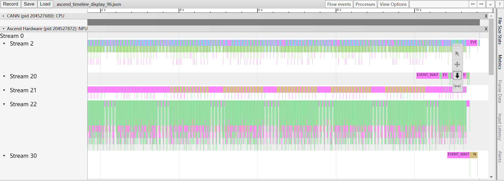
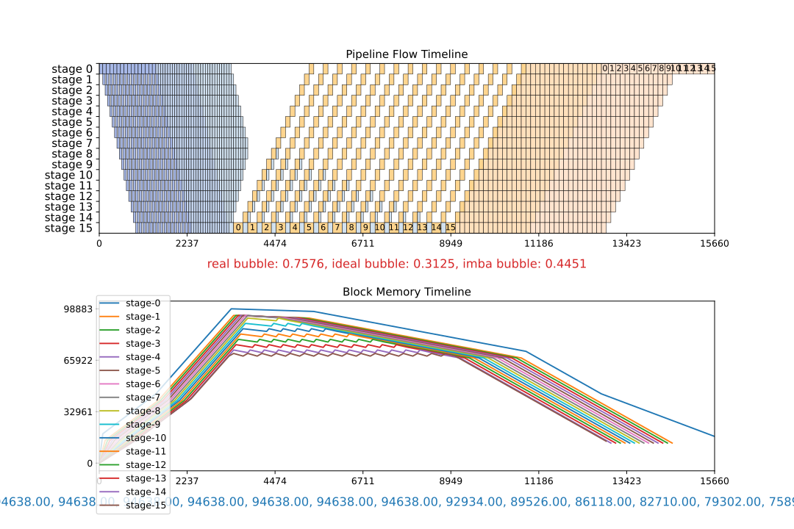

# SAPP流水线负载均衡

流水线并行（pipeline parallelism）可以将神经网络模型切分为不同部分，映射到不同阶段，每个stage部署到集群上不同的节点。从而让集群可以容纳更大的模型。 目前，计算负载和stage切分会影响时间上的不均衡，而内存负载和重计算策略会带来空间上的不均衡。要达到最佳效果，必须同时均衡计算和内存的负载。SAPP流水线负载均衡工具则可以自动生成策略达成均衡。

使用工具的总体流程如下： 

用户需要给工具提供一个yaml文件用以描述模型的内存和时间信息（下文将介绍如何填写yaml文件），工具基于这些信息自动构建线性规划问题，通过全局求解给出一个最优的重计算+offset策略。

## 使用指南

### 基本步骤

Step1. 使用SAPP流水线负载均衡工具需要给定一个yaml文件（init文件）中给定关于模型的时间和内存信息。得到这些信息可能需要Profiling和DryRun，可见下文[Profiling和DryRun](#profiling和dryrun)。

```yaml
# pipeline_config
pipeline_config:
  pipeline_num: 16
  num_layer: 96
  offset: [-1, 1, -1, 1, -1, 1, -1, 1, -1, 1, -1, 1, -1, 1, -1, 1]

# time_config
time_config:
  head: 90
  body: 90
  tail: 180

# recompute_config
recompute_config:
  recompute: false
  select_recompute: [1, 0, 0, 0, 1, 1, 2, 0, 0, 0, 1, 1, 2, 0, 0, 1]
  select_comm_recompute: [1, 0, 0, 0, 0, 0, 0, 1, 1, 2, 1, 1, 2, 0, 0, 1]

# head memory and tail memory are necessary.
# num of body memories = type of recompute + 3 --> the influence of implicit constant memory is not considered
# num of body memories = type of recompute + 4 --> the influence of implicit constant memory is considered
memory_usage:
  head_memory: 77698
  tail_memory: 21822
  body_memories:
    stage_id: [6,9,10,11,12,13]
    memories: [49732,50435,32341,41228,23134,30998]
```

yaml中的字段含义如下：

| 参数名 | 含义 | 取值范围 |
|  ----  | ----  | ---- |
| `pipeline_config` | 流水线的基本配置 |
| `pipeline_num` | 流水线并行的stage数 | int |
| `num_layer` | 模型层数 | int |
| `offset` | 配置的offset ，实际stage中的层数是总层数均分的情况下加上offset的值| 支持list、list of lists以及数字0作为输入 |
| `time_config` | 模型各部分的时间关系 |
| `head_time` | 最开始的embedding层前向时间 | float, int |
| `body_time` | 中间迭代的decoder layer时间 | float, int |
| `tail_time` | 结尾的rmsnorm等时间 | float, int |
| `recompute_config` | 配置的重计算策略 |
| `recompute` | 完全重计算配置 | 支持list，bool或list of lists作为输入 |
| `select_recompute` | 选择重计算配置 | 支持list，bool或list of lists作为输入 |
| `select_comm_recompute` | 通信重计算配置 | 支持list，bool或list of lists作为输入 |
| `memory_usage` | 模型运行结束后得到的Used peak（或Total Static）|
| `head_memory` | 第一个stage的显存占用，单位为mb | int |
| `tail_memory` | 最后一个stage的显存占用，单位为mb | int |
| `body_memories` | 中间stage的显存占用 |
| `stage_id` | 被选定用于内存分解计算的stage的序号, 选择的stage数量应等于 3 + 纳入建模的重计算种类 | 支持list或list of lists |
| `memories`| stage_id中对应stage的显存占用|支持list或list of lists |

其中memory的部分可以借助DryRun，time部分可以通过Profiling信息获得。

Step2. 有了这个yaml文件后，需要从Mindformers中获取工具，可以按如下方式执行：

```bash

git clone https://gitee.com/mindspore/mindformers.git
cd mindformers
export PYTHONPATH=`pwd`
cd toolkit/pipeline_balance

python run_pipeline_balance.py --init <init_file> -m <model_name> -mb <micro_barch_num> -mem <max_mem> -s <stage_num> -i <vpp_num> -t <time_limit>
```

工具涉及的参数含义如下：

| 参数 | 含义 | 取值范围 |
|----|----|:----:|
|--init| init文件的相对位置 | str，默认None |
|-m|模型名称（自定义）| str，默认"model_name" |
|-mb|micro batch数 | int，默认4 |
|-mem| 最大可用显存，单位为mb | int，默认56000 |
|-s|流水线stage数| int，默认4 |
|-i|pipeline interleave数 |int，默认1|
|-t| 求解器搜索时间的上限，以秒为单位 | int，默认90 |
|-naive| 是否对naive配置进行模拟 | 0或1，默认关闭 |
|-manual| 手工并行策略配置的路径 | str，默认关闭 |

Step3. 在输出结果中可以看到推荐策略，以及这个策略的流水线bubble：

```plain
To put in yaml configuration:
        offset: [[-2, -1, -1, 0, 0, 0, 0, 0, 0, 0, 1, 1, 1, 1, 1, -1]]
        recompute: [[0, 0, 0, 0, 0, 0, 0, 0, 0, 0, 0, 0, 0, 0, 0, 0]]
        select_recompute: [[0, 0, 0, 6, 0, 3, 2, 4, 2, 0, 0, 0, 0, 0, 0, 0]]
        select_comm_recompute: [[3, 5, 4, 6, 6, 4, 3, 1, 0, 0, 0, 0, 0, 0, 0, 0]]

————————————— pp: 8, vp: 1, micro: 32 ————————————
--------------------  bubble  --------------------
   real    =   ideal   +   imba    + recompute
  0.5743   =  0.2188   +  0.2947   +  0.0608
```

面向动态图时，流水线每个stage的层数要加上offset的值，比如均分的情况下每个stage应该有6层，此时若算出来此stage的offset为1，则实际应填的就是7。例如当总层数为96时，如果分了16个stage，默认的均匀切分会使每个stage中有6个layer，那么[-2, -1, -1, 0, 0, 0, 0, 0, 0, 0, 1, 1, 1, 1, 1, -1]这一offset对应成layer就是[4, 5, 5, 6, 6, 6, 6, 6, 6, 6, 7, 7, 7, 7, 7, 5]。

### pp < 6的情形

注意，当运行一次提供不了足够的stage数据的时候，就需要运行多轮。以pp=4为例可以按如下方式提供：

```yaml
# pipeline_config
pipeline_config:
  pipeline_num: 4
  num_layer: 80
  offset: [[0,1,-1,0],[0,-1,1,0]] #通过list of lists的方式提供两轮数据

# recompute_config
recompute_config:
  recompute: [[1,2,1,1],[1,3,4,1]]
  select_recompute: [false,false]
  select_comm_recompute: [false,false]

memory_usage:
  head_memory: 66502
  tail_memory: 25599
  body_memories:
    stage_id: [[1,2],[1,2]]
    memories: [[52536,35595],[45439,35700]]
```

## 算法原理

工具在构建线性规划的时候，需要有流水线各个阶段的内存数据作为输入，这里将简述内存计算的原理，以及第一次执行该如何配置。

### 内存分解原理

内存是通过线性方程组的求解得以分解的。 假设有一个stage数为$pp$的流水线，每个stage的内存值为$M_i$，stage中的layer数为$n_i$，重计算层数为$r_i$，$i$为stage id。

内存将被分解为如下几项：

`mem_par`: 每个layer由参数带来的内存

`mem_act`: 每个layer前向算出的激活值占的内存

`mem_rec`: 开启重计算之后mem_act所占的内存

`mem_head`: 首stage的额外内存（比如embedding带来的内存）

`mem_tail`: 尾stage的额外内存（比如LM_head带来的内存）

`mem_const`: 每个stage中由优化器等带来的固定开销

这些内存构成构成如下关系：

$$
m_i = n_i \times mem\_par + (pp - i) \times (r_i \times mem\_rec + (n_i-r_i) \times mem\_act) + mem\_const
$$

$$
M_i =
\begin{cases}
m_i + mem\_head \quad i = 0 \\
m_i + mem\_tail \quad i = pp - 1 \\
m_i \quad else
\end{cases}
$$

这里涉及了6个未知量，也就需要建立6个方程去求解。如果涉及不止一种重计算，比如同时有完全重计算和选择重计算，此时就需要有7个stage的数据才能求解。

综上需要如下stage的显存开销：

第一个stage和最后一个stage，加上 (3 + 重计算种类) 个中间stage。重计算种类有完全重计算、选择重计算和通信重计算。

注意，此时这些中间stage的offset不能配置成完全一样，否则方程组无法求出`mem_const`。

如果只提供了 (2 + 重计算种类) 个中间stage，那么工具会放弃计算`mem_const`，可能会带来内存误差。

### 有解配置

为了让工具能够分解模型的内存，需要先运行一次模型得到各个stage的内存。这一次运行的配置比较随意，只要重计算和offset的配置能让上述的线性方程组有解即可。

#### pp >= 6

只需要给出一个有解的配置即可。比如重计算配置为[1,1,1,2,2,...,1]。具体的数字其实不影响结果。

#### pp < 6

此时运行一轮无法提供足够的stage数据，所以要运行多轮。

以pp=4为例，第一轮的完全重计算配置为[1,1,2,1]。

第二轮的完全重计算配置为[1,3,4,1]。

这时候取第一轮的数据加上第二轮中间两个stage的数据，工具就可以分解出内存。

### 线性规划

内存分解了之后，和模型的时间信息整合起来构成了模型抽象的符号化表达。工具会把这些符号进行编排，构建出内存和模型执行的约束，在这些约束下以最小化端到端时间为优化方向求解线性规划问题，最后得到最优的offset和重计算策略。

## Profiling和DryRun

在调优过程中，profiling可以给出模型执行的性能数据，而DryRun可以给出具体Device的内存数据。这两项技术对于调优有重大意义，这里简述使用方法。

### Profililng

profiling生成的`ascend_timeline_display_*.json`可以在`chrome://tracing`中展示。可视化算子级的性能数据。如图：



为了知道head、body和tail之间的时间关系，需要拥有第一个rank和最后一个rank的profiling信息。有了这些信息的情况下，以pangu38B网络为例，可以通过以下几步获得head、body和tail的时间。

1. body时间：在任意rank的profiling中，搜索flash attention。两个flash attention的前向算子之间的时间就是body的时间；
2. head时间：在第一个rank的profiling中，在flash attention的正向之前，inplacecopy算子之前到第一个rmsNorm之前的时间为embedding的时间，即head时间；
3. tail时间：在最后一个rank的profiling中，最后一个正向的flash attention算子后面的第2个rmsNorm加上add算子，到gatherNd之间的时间为lm_head的时间，即tail时间。

详细文档也可见[mindspore的profiling指南](https://www.mindspore.cn/docs/zh-CN/r2.4.0/model_train/optimize/profiler.html)。

### DryRun

DryRun对模型进行模拟编译，可以给出被模拟的device的内存占用。

设置如下环境变量，即可开启DryRun。

```bash
export MS_SIMULATION_LEVEL=1
export MS_MEMORY_STATISTIC=1
```

执行结束后会产生对应rank的日志。日志的末尾会给出内存信息，可以通过`grep -rn 'Used peak'`进行收集。如下，Used peak可以认为是模型内存占用的理论值，而Actual peak则是加上了由于碎片等内存分配机制带来的额外开销后的真实值。

```plain
Device HBM memory size: 62432M
MindSpore Used memory size: 59392M
MindSpore memory base address: 0
Used peak memory usage (without fragments): 48874M
Actual peak memory usage (with fragments): 48874M
```

## 比较不同的策略

为了在调优时比较不同的策略，我们提供了灵活的接口调用模拟器对不同策略进行模拟。目前接受两种方式产生模拟结果。一种是自动产生两个naive策略，另一种是用户自己手工提供一个想要用来比较的策略。二者可同时使用。但是要注意不论是naive还是手工都不能处理没有被提供的重计算，比如init的时候yaml里面只提供了完全重计算，那么无法生成考虑了选择重计算的naive或者手工策略。

1. 自动生成naive策略

当模型层数能被流水线层数与流水线interleave数的乘积所整除的时候，且init的时候提供了完全重计算的显存开销。在执行时加上`-naive 1`即会自动给出重计算开满和重计算不开这两种情形下模拟器的模拟结果。

```bash
python run_pipeline_balance.py --init ./cfgs/init_demo -m demo -s 16 -i 3 -mb 16 -mem 62000 -t 150 -naive 1
```

同时除了求解出的推荐策略之外，会在`output`目录下生成另外两个svg文件，result_naive_no_recomp以及result_naive_all_recomp：

```bash
$ ls ./output

result.svg result_naive_no_recomp.svg result_naive_all_recomp.svg
```

2. 生成人工策略的结果

```bash
python run_pipeline_balance.py --init ./cfgs/init_demo -m demo -s 16 -i 3 -mb 16 -mem 62000 -t 150 -manual cfgs/manual.yaml
```

manual.yaml的格式如下：

```yaml
# simulate configs
manual1:
  offset:  [[-1, -1, -1, -1, -1, -1, -1, -1, -1, -1, -1, -1, 0, 0, 0, 0], [-1, 0, 0, 0, 0, 0, 0, 0, 0, 1, 1, 1, 0, 0, 1, 1], [1, 1, 1, 1, 1, 1, 1, 1, 1, 0, 0, 0, 0, 0, 0, -1]]
  recompute: false
  select_recompute: [[1, 1, 1, 1, 1, 1, 1, 1, 1, 1, 1, 1, 2, 2, 2, 2], [1, 2, 2, 2, 2, 2, 2, 2, 2, 3, 3, 3, 2, 2, 3, 3], [3, 3, 3, 3, 3, 3, 3, 3, 3, 2, 2, 2, 2, 0, 1, 0]]
  select_comm_recompute: [[1, 1, 1, 1, 1, 1, 1, 1, 1, 1, 1, 0, 1, 2, 2, 2], [1, 2, 2, 2, 2, 2, 2, 2, 2, 3, 3, 3, 2, 2, 3, 3], [3, 3, 3, 3, 3, 3, 3, 3, 3, 2, 2, 2, 2, 0, 1, 0]]
  interleave_num: 3
  show: True
  file_name: "manual1.svg"
```

下图展示了推荐策略和naive、人工策略的比较。

可以看到重计算开满的时候性能会比较差，而不开重计算则会超过显存上限。工具求出的策略则会在显存上限的约束下得到最优的性能，这可以通过和人工策略的比较得到确证。见下图：
|算法结果             |  手工调优  |
|:-------------------------:|:-------------------------:|
 | |

| 全量开启重计算             |  关闭重计算  |
|:-------------------------:|:-------------------------:|
|||

